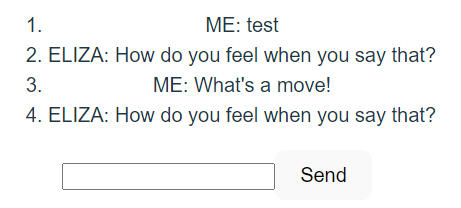

# Connect

動機

ref: [Programming カテゴリ gRPC がフロントエンド通信の第一の選択肢になる時代がやってきたかも？](https://future-architect.github.io/articles/20220819a/)

## gRPC-Web があるのに何故 Connect-Web ができた？

以下をヒントに調べる。結論から言うと、大体当っていそう

> ※ このあたり理解がめちゃ浅いです
> RPC (Remote Procedure Call) を実現するためのプロトコルとして、gRPC があります。
> このプロトコルは、ブラウザ側からは使えない(?)ため、gRPC-Web というブラウザ向けの gRPC というものを使うことになります。
> その場合、ブラウザとサーバーとの間に、プロキシを建てる必要があるようです。(たぶん)
> そこで、Connect という gRPC 互換の HTTP API を構築するためのライブラリ群が開発されました。
> これのおかげで、プロキシを建てる必要がなく、ブラウザ側から gRPC を使うことが可能になります。

ref : [connect-web やってみた](https://zenn.dev/silverbirder/articles/aaa2c196991b53)

gRPC-Web を gRPC に変換する proxy 層 が必須

### gRPC-Web とは

> gRPC-web クライアントは、特別なプロキシ経由で gRPC サービスに接続します。デフォルトでは、gRPC-web は Envoy を使用します。

ref: [gRPC Web (Github)](https://github.com/grpc/grpc-web#grpc-web--)

> gRPC は Google が公開している RPC 方式で、Protocol Buffers と HTTP/2 をベースにしたバイナリプロトコル
>
> ブラウザは HTTP/2 に対応していないブラウザもまだまだ現役でたくさんいますし、バイナリを扱うのが苦手
>
> ブラウザでも利用できる gRPC-Web という新しいプロトコルを作り、gRPC-Web を gRPC に変換する proxy 層を介して通信することで、gRPC の旨味をブラウザでも利用できるようにする、というのが gRPC-Web

ref: [gRPC-Web を利用したクライアント・サーバー間の通信](https://hokaccha.hatenablog.com/entry/2019/12/04/122558)

なぜプロキシを挟む必要があるのか

> ただ、gRPC-Web 自体はクライアント → バックエンド間は HTTP/1.1 になりますので、間にプロキシを挟む必要があります。(Envoy や Nginx 等で可能です)

以下を要約すると、ブラウザーは、HTTP 2 経由で web サーバーと通信できる場合は HTTP 2 を使用するが、それ以外の場合は（勝手に）HTTP/1.1 にフォールバックする。
通信プロトコルはレイヤーアーキテクチャなので、上位に位置する Web アプリケーションが下位で使われているのが HTTP/2 なのか、あるいは HTTP/1.1 なのかを認識できないし、意識するべきではない（ブラウザーは JavaScript によって HTTP 2 でのみ利用可能な機能を制御する方法を提供ししない）

故に gRPC-Web は HTTP/1.1 固定で送受信。これを HTTP/2 & gRPC で送るために、プロキシが必要

refs:

- [Go+gRPC-Web のアプリケーションを GKE+Envoy で負荷分散する - なぜプロキシを挟む必要があるのか](https://qiita.com/hirokikondo86/items/65e7dd55d189cd2ca181#%E3%81%AA%E3%81%9C%E3%83%97%E3%83%AD%E3%82%AD%E3%82%B7%E3%82%92%E6%8C%9F%E3%82%80%E5%BF%85%E8%A6%81%E3%81%8C%E3%81%82%E3%82%8B%E3%81%AE%E3%81%8B)
- [Why gRPC-Web Needs Proxy](https://yuku.takahashi.coffee/blog/2019/01/grpc-proxy-for-grpc-web)

プロキシには、Envoy を使うのが一般的らしい（[gRPC-Web のチュートリアル](https://grpc.io/docs/platforms/web/quickstart/)でも、Enovy を使用している）

### Envoy Proxy とは

> Nginx と似た機能を持つ OSS で、マイクロサービスに対応するため、サービス間のネットワーク制御をライブラリとしてではなく、ネットワークプロキシとして提供することを目的に開発

ref: [Envoy Proxy を始めてみよう](https://qiita.com/zakiyamac09/items/75d62e8b82456f180216)

Envoy はクライアント →Envoy、Envoy→ バックエンドサーバ間の両方とも HTTP/2 と gRPC をサポートしている。

Enovy の機能概要に関しては、以下が参考になりそう

ref: [Envoy: gRPC](https://qiita.com/kentakozuka/items/b4b7a1686df1e57bc5c5)

### Connect とは

> Connect は、ブラウザや gRPC 互換の HTTP API を構築するためのライブラリ群です。短い Protocol Buffer スキーマを記述し、アプリケーションロジックを実装すると、 Connect がマーシャリング、ルーティング、圧縮、コンテントタイプネゴシエーションを処理するコードを生成します。また、サポートされているあらゆる言語で、慣用的なタイプセーフなクライアントが生成されます。

ref: [Connect Docs - Introduction](https://connect.build/docs/introduction/)

> 新しい Connect プロトコルは、HTTP/1.1 または HTTP/2 で動作する、シンプルな POST プロトコルです。ストリーミングを含む gRPC と gRPC-Web の最良の部分を取り込み、ブラウザ、モノリス、マイクロサービスにおいて同様に動作するプロトコルにパッケージ化しました。Connect プロトコルは、私たちが考える gRPC プロトコルのあるべき姿です。デフォルトでは、JSON とバイナリでエンコードされた Protobuf がサポートされています。

ref [Connect Docs - Use the gRPC protocol instead of the Connect protocol](https://connect.build/docs/go/getting-started#use-the-grpc-protocol-instead-of-the-connect-protocol)

ドキュメントを読む限り、Connect は独自のプロトコル（Connect プロトコル？）を用いることで、gRPC を使うなら HTTP/2.0 前提だった制約を解消したように取れる。gRPc/gRPC-Web プロトコルをサポートしているから、既に gRPc/gRPC-Web を使用しているシステムでクライアント/サーバ片側だけ Connect に入れ替えてひとまず gRPc/gRPC-Web を使うといったことも可能？（＝段階移行可能？）なようにも読み取れる

- Connect は、ストリーミングを含む gRPC および gRPC-Web プロトコルを完全にサポート
- Connect は独自のプロトコルをサポートしている（HTTP/1.1 と HTTP/2 で動作する簡単で POST のみのプロトコル）
- 故に、Envoy のような変換プロキシに依存することなく、grpc/grpc-web によって使用される gRPC-Web プロトコルを直接サポート
- Connect サーバは 3 つのプロトコルすべてからの入力をサポート
- クライアントは既定で Connect プロトコルを使用するが、gRPC または gRPC-Web に切り替えも可能

ドキュメントには以下の通り（翻訳機和訳）の記載されているため、信頼性/安定性といったところに重きを置いていることが伺える。

> Connect は、私たちの考えるプロダクショングレードの RPC です。なぜなら、誰も複雑なネットワークのデバッグや、100 もの難解なオプションを吟味している時間はないからです。
>
> その下には、プロトコルバッファと net/http、fetch、URLSession、または HTTP のためのあなたの言語のゴールドスタンダードがあるだけです。
>
> 何よりも、Connect は安定しています。私たちは後方互換性を非常に重視しており、安定版リリースのタグを付けた後にあなたのビルドを壊すことは決してありません。

#### Connect-Web

> Connect-Web は、Web ブラウザからリモートプロシージャを呼び出すための小さなライブラリです。REST とは異なり、タイプセーフなクライアントが得られ、シリアライゼーションについて考える必要はもうない。

## チュートリアル

### connect-go

#### Get Stated

```
mkdir connect-go-example
cd connect-go-example
go mod init example
go install github.com/bufbuild/buf/cmd/buf@latest
go install github.com/fullstorydev/grpcurl/cmd/grpcurl@latest
go install google.golang.org/protobuf/cmd/protoc-gen-go@latest
go install github.com/bufbuild/connect-go/cmd/protoc-gen-connect-go@latest
```

サービスを定義

```
mkdir -p greet/v1
touch greet/v1/greet.proto
```

buf.yaml 生成～コード自動生成

```
buf mod init
// buf.gen.yaml を生成してから
buf lint
buf generate
```

tutorial のコードをそのまま実装。中身的には gRPC のはずなのに curl でリクエスト投げればレスポンスが返ってくる（素晴らしい）

```
$ curl \
    --header "Content-Type: application/json" \
    --data '{"name": "Jane"}' \
    http://localhost:8080/greet.v1.GreetService/Greet

{"greeting":"Hello, Jane!"}
```

### ルーティング

通常の API との併用も可能

```golang
	api := http.NewServeMux()
	path, handler := greetv1connect.NewGreetServiceHandler(&server.GreetServer{})
	api.Handle(path, handler)

	mux := http.NewServeMux()
	// mux.Handle(path, handler)
	mux.Handle("/hello", helloHandler{})
	mux.Handle("/connect/", http.StripPrefix("/connect", api))
	http.ListenAndServe(
		"localhost:8080",
		// Use h2c so we can serve HTTP/2 without TLS.
		h2c.NewHandler(mux, &http2.Server{}),
	)
```

```
$ curl --header "Content-Type: application/json" --data '{"name": "Jane"}' http://localhost:8080/connect/greet.v1.GreetService/Greet
{"greeting":"Hello, Jane!"}

$ curl http://localhost:8080/hello
{"message":"hello world"}
```

#### ERROR

エラーコードとの対応： https://connect.build/docs/protocol/#error-codes

- connect.CodeInvalidArgument

```
$ curl --header "Content-Type: application/json" --data '{"name": ""}' http://localhost:8080/connect/greet.v1.GreetService/Greet
{"code":"invalid_argument","message":"No name specified for greeting"}
```

- connect.CodeUnknown

```
$ curl --header "Content-Type: application/json" --data '{"name": "error"}' http://localhost:8080/connect/greet.v1.GreetService/Greet
{"code":"unknown","message":"invalid name"}
```

#### Interceptors

- ミドルウェアまたはデコレータに似たもの。Connect を拡張するための主要な方法
- コンテキスト、要求、応答、およびエラーを変更可能。また、ロギング、メトリック、トレース、再試行などの機能を追加するためによく使用

docs の NewAuthInterceptor を実装：https://connect.build/docs/go/interceptors

概要：トークンヘッダー：Acme-Token がないとエラー

- トークンヘッダーなし

```
$ curl --header "Content-Type: application/json" --data '{"name": "Jane"}' http://localhost:8080/connect/greet.v1.GreetService/Greet
{"code":"unauthenticated","message":"no token provided"}
```

```
$ go run cmd/client/main.go
2022/08/24 22:50:42 unauthenticated: no token provided
```

- トークンヘッダーあり

```
$ curl --header "Content-Type: application/json" -H "Acme-Token: test" --data '{"name": "Jane"}' http://localhost:8080/connect/greet.v1.GreetService/Greet
{"greeting":"Hello, Jane!"}
```

```
$ go run cmd/client/main.go
2022/08/24 22:53:09 Hello, Jane!
```

#### Streaming

docs のコードを実装：https://connect.build/docs/go/streaming

streming で送信する必要があるので、クライアント側に以下を追加して送信してみた

```golang
	clientStream := client.Greet(
		context.Background(),
	)
	clientStream.Send(&greetv1.GreetRequest{Name: "Verstappen"})
	clientStream.Send(&greetv1.GreetRequest{Name: "Hamilton"})
	clientStream.Send(&greetv1.GreetRequest{Name: "Leclerc"})
	res2, err := clientStream.CloseAndReceive()
	if err != nil {
		log.Println(err)
		return
	}
	log.Println(res2.Msg.Greeting)
```

出力

```
2022/08/25 00:04:31 Hello, Verstappen!
Hello, Hamilton!
Hello, Leclerc!
```

### connect-web

初期構築

```
npm create vite@latest -- connect-web-example --template react-ts
cd connect-web-example
npm install
```

#### remote generation

```
// 以下2行は Buf Schema Registry の機能であるリモート生成を使するため
// 対象： https://buf.build/bufbuild/eliza
npm config set @buf:registry https://npm.buf.build
npm install @buf/bufbuild_connect-web_bufbuild_eliza
```

★[Buf Schema Registry (BSR)](https://buf.build/)

- 2022/8 末時点まだベータ版。Github や DockerHub の buf 版のようなイメージのもの

> - Protocol Buffers を使用するためには、使用する言語ごとにコードを生成する必要がある ⇒ この手間を解消する リモートコード生成機能がある
> - 標準のパッケージマネージャーとビルドツールを使用して Protobuf 定義から生成されたコードを直接インストール可能
> - 2022/8 末時点 alpha 版だが JavaScript、TypeScript、Go のリモートコード生成をサポート（npm/yarn/go module 等でインストール可能）
> - ローカルでコード生成する必要がないため、ワークフローからのコード生成を排除したり、protoc プラグインのような実行時の依存関係を維持する必要がなくなる

ref: [Buf Docs - Remote generation](https://docs.buf.build/bsr/remote-generation/overview)

[Connect for Web - Getting started](https://connect.build/docs/web/getting-started) のコードを実装して

```
npm run dev
```



#### local generation

ローカル生成も可能：https://connect.build/docs/web/generating-code

```
npm install --save-dev @bufbuild/protoc-gen-connect-web @bufbuild/protoc-gen-es
npm install @bufbuild/connect-web @bufbuild/protobuf
```

docs にある内容で buf.gen.yaml 作成して

```
buf generate
```

#### Using clients

## おまけ

use： golang、connect、solidjs

```
go mod init connect-try
npx degit solidjs/templates/ts frontend

go install github.com/bufbuild/buf/cmd/buf@latest
go install google.golang.org/protobuf/cmd/protoc-gen-go@latest
go install github.com/bufbuild/connect-go/cmd/protoc-gen-connect-go@latest
cd frontend
npm install --save-dev @bufbuild/protoc-gen-connect-web @bufbuild/protoc-gen-es
npm install @bufbuild/connect-web
```

```
buf mod init  // buf.yaml 自動生成
// buf.gen.yaml 作成してから
buf generate
```

※ buf.gen.yaml の path の項目は、使用 OS にパスセパレータを合わせないと buf generate が失敗する

## refs

- [よくわかる context の使い方](https://zenn.dev/hsaki/books/golang-context/viewer/done)

- [frontend-go](https://github.com/shibukawa/frontend-go)

  - go サーバー用の SPA (Single Page Application) スタイル Web アプリケーションフロントエンドヘルパー。このパッケージは、Next.js、Vue.js、SvelteKit、Solid.js で動作します。
  - リバースプロキシとして機能？ リクエストを go の server で受け取り、go 側の API やフロントエンドへの振り分けを行うイメージ

- [Buf Docs](https://docs.buf.build/configuration/v1/buf-gen-yaml)
