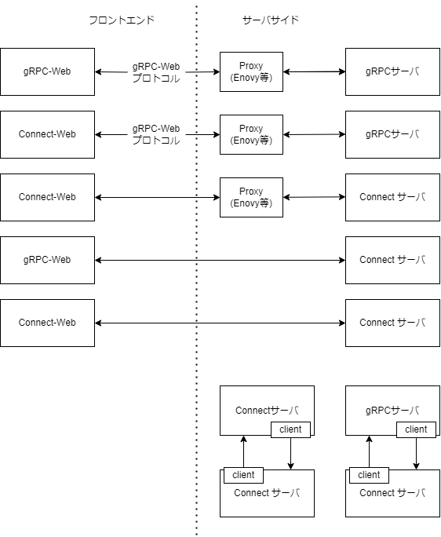
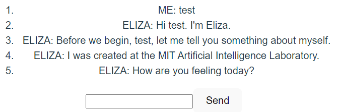

# Connect

## はじめに

以下を読み、Connect-Web なるものの 1.0 がリリースされたことを知りました。

ref: [Programming カテゴリ gRPC がフロントエンド通信の第一の選択肢になる時代がやってきたかも？](https://future-architect.github.io/articles/20220819a/)

gRPC については、[Go 言語で学ぶ実践 gRPC 入門 (Udemy 講座)](https://www.udemy.com/course/go-grpc-x/) を通してド基礎を抑えただけの状態であったため、これを機に gRPC 関連を色々調べた。

本記事では

- gRPC 関連で色々調べたこと
- Connect のチュートリアルを部分的＆一部追加して試したこと

をまとめる。

gRPC とは？ は省くが、以下が参考になるかと思われる

ref:

- [What is gRPC? - Introduction to gRPC](https://grpc.io/docs/what-is-grpc/introduction/)
- [作ってわかる！ はじめての gRPC](https://zenn.dev/hsaki/books/golang-grpc-starting)

まずは Connect が作られた背景を簡単に探る。

## 何故 Connect ができたのか？

新しい物を作るということは、往々にして解決したい課題があるからと考える。以下の通り gRPC には以下のような課題があるらしい。

> あえて作ったのは既存の実装にいろいろ不満があるからということです。
>
> - コメントを除いて 100 以上のパッケージで合計 13 万行ででかすぎる
> - Go 標準ではなく独自実装の HTTP/2 実装を使っていて、Go の標準的なミドルウェアなどが使えない
> - ウェブから使うにはプロキシが必要
> - デバッグ大変
> - セマンティックバージョニングを使ってない

ref: [gRPC の Go 実装の新星、Connect](https://future-architect.github.io/articles/20220623a/)

gRPC サーバは、HTTP/2 が前提となる、それに起因する課題が発生することは想像に容易いが、上記の中の「ウェブから使うにはプロキシが必要」に関して、現状に関して無知なため、ここを切り口に探ることとした。

※詳細を述べると、gRPC には[gRPC-Web](https://github.com/grpc/grpc-web) という gRPC 通信を Web で使うことができるようにするためのものが既にある。Connect にも同様に Connect-Web があるが、Web から使用する部分も作り直す必要があった点に関して gRPC-Web に関して無知なため、想像が付かなかった。

そこで、以下をヒントに調べめ始めた。結論から言うと、以下の内容は概ね当っていると思った。

> ※ このあたり理解がめちゃ浅いです
> RPC (Remote Procedure Call) を実現するためのプロトコルとして、gRPC があります。
> このプロトコルは、ブラウザ側からは使えない(?)ため、gRPC-Web というブラウザ向けの gRPC というものを使うことになります。
> その場合、ブラウザとサーバーとの間に、プロキシを建てる必要があるようです。(たぶん)
> そこで、Connect という gRPC 互換の HTTP API を構築するためのライブラリ群が開発されました。
> これのおかげで、プロキシを建てる必要がなく、ブラウザ側から gRPC を使うことが可能になります。

ref : [connect-web やってみた](https://zenn.dev/silverbirder/articles/aaa2c196991b53)

その根拠を、gRPC-Web とは、から順を追って記載する。

### gRPC-Web とは

そもそも gRPC-Web ができた背景は以下の通り。

> gRPC は Google が公開している RPC 方式で、Protocol Buffers と HTTP/2 をベースにしたバイナリプロトコル
>
> ブラウザは HTTP/2 に対応していないブラウザもまだまだ現役でたくさんいますし、バイナリを扱うのが苦手
>
> ブラウザでも利用できる gRPC-Web という新しいプロトコルを作り、gRPC-Web を gRPC に変換する proxy 層を介して通信することで、gRPC の旨味をブラウザでも利用できるようにする、というのが gRPC-Web

ref: [gRPC-Web を利用したクライアント・サーバー間の通信](https://hokaccha.hatenablog.com/entry/2019/12/04/122558)

Github リポジトリの README にも記載がある通り、gRPC-Web を gRPC に変換する proxy 層 が必要とだけ記載されている。

> gRPC-web クライアントは、特別なプロキシ経由で gRPC サービスに接続します。デフォルトでは、gRPC-web は Envoy を使用します。

ref: [gRPC Web (Github - README.md)](https://github.com/grpc/grpc-web#grpc-web--)

#### proxy が必要な理由

では、なぜプロキシを挟む必要があるのか？

理由は以下の通りと思われる。

> - ブラウザーで実行されている JavaScript では、HTTP2 を完全に制御することはできません。
> - gRPC プロトコルは、JavaScript では制御できない HTTP/2 の機能を使用します。
> - そして、制限が解除されることはないと思います。
>   - ブラウザーは、HTTP 2 経由で web サーバーと通信できる場合は HTTP 2 を使用するが、それ以外の場合は（勝手に）HTTP/1.1 にフォールバックする。
>   - 上位に位置する Web アプリケーション（恐らくフロントエンド）が下位（恐らくサーバサイド）で使われているのが HTTP/2 なのか、あるいは HTTP/1.1 なのかを認識できないし、意識するべきではない（HTTP/1.1 と HTTP2 を透過的に処理できる必要がある）
>   - (故に) HTTP2 でのみ使用可能な機能を JavaScript で制御する方法がブラウザに提供されることはない
>
> (翻訳機和訳含む)

refs:

- [Why gRPC-Web Needs Proxy](https://yuku.takahashi.coffee/blog/2019/01/grpc-proxy-for-grpc-web)
- [Go+gRPC-Web のアプリケーションを GKE+Envoy で負荷分散する - なぜプロキシを挟む必要があるのか](https://qiita.com/hirokikondo86/items/65e7dd55d189cd2ca181#%E3%81%AA%E3%81%9C%E3%83%97%E3%83%AD%E3%82%AD%E3%82%B7%E3%82%92%E6%8C%9F%E3%82%80%E5%BF%85%E8%A6%81%E3%81%8C%E3%81%82%E3%82%8B%E3%81%AE%E3%81%8B)

要約すると、ブラウザは HTTP/1.1 を使うか HTTP/2 を使うかをブラウザを使用する人には意識させず、透過的に処理する。HTTP/2 を指定して使うといった制御は JavaScript ではできない、かつ（HTTP/1.1 と HTTP2 を透過的に処理できる必要があるため）今後も JavaScript で制御する方法は提供されないだろう。だが、gRPC サーバへの送信 は HTTP/2 で行う必要がある。(といった所でしょうか)

※こちらも参考になるかと思われる ⇒ [ブラウザで HTTP/2 ストリーム接続を実装するには? (stackoverflow)](https://stackoverflow.com/questions/52273174/how-to-implement-http-2-stream-connection-in-browser)

また、gRPC は HTTP トレーラー(trailer) を多用するが、Web ブラウザーを含む 多くの HTTP 実装は、まだトレーラーをサポートしていない。gRPC-Web では、応答本文の末尾にトレーラーをエンコードして付与することでその問題を解決しているとのこと。

ref:

- [gRPC バックエンドを呼び出すためにプロキシが必要なのはなぜですか？](https://connect.build/docs/faq#why-do-i-need-a-proxy-to-call-grpc-backends)
- [gRPC Web (Github - PROTOCOL-WEB.md)](https://github.com/grpc/grpc/blob/master/doc/PROTOCOL-WEB.md)

#### gRPC-Web のソースを追う

以下個人的に気になった点を、実際のソースを追って、gRPC-Web の仕組みの一端を確認してみる。

- 応答本文の末尾にトレーラーをエンコードして付与
- リクエスト送信方法

以下より、ストリーミング受信時は応答本文（responseText）から trailer を取り出してるように見える（該当ソース一部抜粋。ここ以外にもあるかもしれないが）

```javascript
class GrpcWebClientReadableStream {
  // : 省略
  const self = this;
  events.listen(this.xhr_, EventType.READY_STATE_CHANGE, function(e) {  // 138行目
    // : 省略
    let byteSource;
    if (googString.startsWith(contentType, 'application/grpc-web-text')) {
      // Ensure responseText is not null
      const responseText = self.xhr_.getResponseText() || '';
      const newPos = responseText.length - responseText.length % 4;
      const newData = responseText.substr(self.pos_, newPos - self.pos_);
      if (newData.length == 0) return;
      self.pos_ = newPos;
      byteSource = googCrypt.decodeStringToUint8Array(newData);
    } else if (googString.startsWith(contentType, 'application/grpc')) {
      byteSource = new Uint8Array(
      /** @type {!ArrayBuffer} */ (self.xhr_.getResponse()));
      } else {
      // : 省略
    }
    let messages = null;
    try {
      messages = self.parser_.parse(byteSource);
    } catch (err) {
      // : 省略
    }
    if (messages) {
      const FrameType = GrpcWebStreamParser.FrameType;
      for (let i = 0; i < messages.length; i++) {
        // : 省略
        if (FrameType.TRAILER in messages[i]) {             // 187行目
          if (messages[i][FrameType.TRAILER].length > 0) {
            let trailerString = '';
            for (let pos = 0; pos < messages[i][FrameType.TRAILER].length;
                  pos++) {
              trailerString +=
                  String.fromCharCode(messages[i][FrameType.TRAILER][pos]);
            }
            const trailers = self.parseHttp1Headers_(trailerString);
    　　　　// : 省略
          }
        }
      }
    }
  });
  // : 省略
}
```

ref: https://github.com/grpc/grpc-web/blob/35284bfe156fc41bbcdd554ac423a587d93ff8da/javascript/net/grpc/web/grpcwebclientreadablestream.js#L187

※this.xhr の実態が何か（xhr = xmlHttpRequest なのか？）念のため更にソースを辿ると

```javascript
// : 省略
const XhrIo = goog.require("goog.net.XhrIo");
// : 省略

class GrpcWebClientBase {
  // : 省略
  startStream_(request, hostname) {
    // 183行目
    const methodDescriptor = request.getMethodDescriptor();
    let path = hostname + methodDescriptor.getName();

    const xhr = this.xhrIo_ ? this.xhrIo_ : new XhrIo();
    xhr.setWithCredentials(this.withCredentials_);

    const genericTransportInterface = {
      xhr: xhr,
    };
    const stream = new GrpcWebClientReadableStream(genericTransportInterface);
    // : 省略
  }
  // : 省略
}
```

ref: https://github.com/grpc/grpc-web/blob/3956560ad01b4af0a2a5c29c081f5bbd1424e85d/javascript/net/grpc/web/grpcwebclientbase.js#L193

[XhrIo](https://google.github.io/closure-library/api/goog.net.XhrIo.html) に行き着いたので、そのソース：[google/closure-library (Github)](https://github.com/google/closure-library)
も見に行った。

```javascript
goog.net.XhrIo.prototype.createXhr = function () {
  "use strict";
  return this.xmlHttpFactory_
    ? this.xmlHttpFactory_.createInstance()
    : goog.net.XmlHttp();
};
```

ref: https://github.com/google/closure-library/blob/951a512d54578e5dbaff148c3bcb406957f78f46/closure/goog/net/xhrio.js#L721

```javascript
// 27行目～
goog.net.XmlHttp = function () {
  "use strict";
  return goog.net.XmlHttp.factory_.createInstance();
};

// 146行目～
goog.net.XmlHttp.setGlobalFactory = function (factory) {
  "use strict";
  goog.net.XmlHttp.factory_ = factory;
};

// 159行目～
goog.net.DefaultXmlHttpFactory = function() {
  'use strict';
  goog.net.XmlHttpFactory.call(this);
};
goog.inherits(goog.net.DefaultXmlHttpFactory, goog.net.XmlHttpFactory);


/** @override */
goog.net.DefaultXmlHttpFactory.prototype.createInstance = function() {
  'use strict';
  const progId = this.getProgId_();
  if (progId) {
    return new ActiveXObject(progId);
  } else {
    return new XMLHttpRequest();
  }

// 250行目～
// Set the global factory to an instance of the default factory.
goog.net.XmlHttp.setGlobalFactory(new goog.net.DefaultXmlHttpFactory());
```

ref: https://github.com/google/closure-library/blob/a0248d22bd094840c2fc9e08d0f39c10bf4beacf/closure/goog/net/xmlhttp.js

（ActiveX…）

gRPC-Web では概ね XMLHttpRequest を使用して送受信を行っていると思われる（※辿り方を間違えていなければ。実は fetch api を使用している箇所もあるが現時点では実験的機能であった。）

※ レスポンスをデコードする仕組みに関しては、以下が参考になると思われる。

ref: [gRPC-web がどのようにリクエストをシリアライズしているのか](https://zenn.dev/link/comments/8af6458a35fb55)

#### Envoy Proxy & gRPC-gateway

簡単に触れておく。

Enovy とは

> Nginx と似た機能を持つ OSS で、マイクロサービスに対応するため、サービス間のネットワーク制御をライブラリとしてではなく、ネットワークプロキシとして提供することを目的に開発

ref: [Envoy Proxy を始めてみよう](https://qiita.com/zakiyamac09/items/75d62e8b82456f180216)

Envoy はクライアント →Envoy、Envoy→ バックエンドサーバ間の両方とも HTTP/2 と gRPC をサポートしている。

また gRPC-Web 用のフィルターがあり、これにより gRPC-Web(クライアント) から gRPC サーバへの通信が可能と思われる。

> gRPC-Web は、 gRPC-Web クライアントが HTTP/1.1 経由で Envoy にリクエストを送信し、gRPC サーバーにプロキシされることを可能にするフィルターによってサポートされています。
> (翻訳機和訳)

ref: [enovy - gRPC](https://www.envoyproxy.io/docs/envoy/latest/intro/arch_overview/other_protocols/grpc.html?highlight=grpc%20web)

それ以外にも、マイクロサービスにおいて発生する様々な問題を取り扱うことができるとのこと。

refs:

- [Envoy の FrontProxy を用意して gRPC の負荷分散をする](https://christina04.hatenablog.com/entry/envoy-front-proxy)
- [Envoy とは？](https://openstandia.jp/oss_info/envoy/)

Enovy 以外の選択肢として gRPC-gateway というものもある。gRPC-gateway とは HTTP JSON API リクエストを gRPC に変換して gRPC サーバーへプロキシできるものである。両者には以下の差異がある。

- gRPC-gateway は golang のみ対応
- Enovy は 複数言語に対応

gRPC に関する Enovy や gRPC-gateway については以下が参考になるかと思われる。

ref:

- [Envoy: gRPC](https://qiita.com/kentakozuka/items/b4b7a1686df1e57bc5c5)
- [ZOZOSUIT から ZOZOMAT へ - Envoy gRPC-JSON transcoder による部分的モダン化の実践](https://techblog.zozo.com/entry/zozomat-envoy-grpc-json-transcoder)
- [grpc-gateway で gRPC と REST 両対応のサーバを作る ](https://future-architect.github.io/articles/20220624a/)
- [gRPC 完全に理解した](https://trap.jp/post/1472/)
- [[gRPC-Gateway, Envoy] gRPC と REST を繋げたい時に．．．](https://qiita.com/ishishow/items/1db134c20c6843f3463e)

#### 補足

Github の README にある通り、gRPC-Web がサポートするのは以下 2 つのため、クライアントストリーミング RPC と双方向ストリーミング RPC は未対応。

> gRPC-web currently supports 2 RPC modes:
>
> - Unary RPCs
> - Server-side Streaming RPCs

ref: [gRPC-Web - Streaming Support](https://github.com/grpc/grpc-web#streaming-support)

理由は、gRPC-Web に proxy 層が必要な理由と概ね同じである。HTTP/1.1 はストリーミング受信はできるが、ストリーミング送信を行うには HTTP/2 である必要があるため。

### Connect とは

Connect についての詳細は以下の通り。（ドキュメントからの抜粋）

> Connect は、ブラウザや gRPC 互換の HTTP API を構築するためのライブラリ群です。短い Protocol Buffer スキーマを記述し、アプリケーションロジックを実装すると、 Connect がマーシャリング、ルーティング、圧縮、コンテントタイプネゴシエーションを処理するコードを生成します。また、サポートされているあらゆる言語で、慣用的なタイプセーフなクライアントが生成されます。

ref: [Connect Docs - Introduction](https://connect.build/docs/introduction/)

> 新しい Connect プロトコルは、HTTP/1.1 または HTTP/2 で動作する、シンプルな POST プロトコルです。ストリーミングを含む gRPC と gRPC-Web の最良の部分を取り込み、ブラウザ、モノリス、マイクロサービスにおいて同様に動作するプロトコルにパッケージ化しました。Connect プロトコルは、私たちが考える gRPC プロトコルのあるべき姿です。デフォルトでは、JSON とバイナリでエンコードされた Protobuf がサポートされています。（翻訳機和訳）

ref [Connect Docs - Use the gRPC protocol instead of the Connect protocol](https://connect.build/docs/go/getting-started#use-the-grpc-protocol-instead-of-the-connect-protocol)

Connect の凄い所を一言で表すと、これまでフロント/サーバ間の gRPC 通信には、proxy 層が必須だったところを
HTTP/1.1，HTTP/2 に捕らわることなく、フロント/サーバ間の gRPC 通信が可能になったことではないかと思われる。

特徴をまとめると、

- Connect は、独自のプロトコル（HTTP/1.1 と HTTP/2 で動作する簡単で POST のみのプロトコル）をサポートすることで、HTTP/1.1 でも利用可能とした (※)
  - Connect 独自のプロトコルは REST API になっており curl で簡単にテストも可能
  - 故に、Envoy のような変換プロキシに依存することなく、grpc/grpc-web によって使用される gRPC-Web プロトコルを直接サポート
- Connect は、ストリーミングを含む gRPC および gRPC-Web プロトコルをサポート
  - Connect サーバは 3 つのプロトコル（Connect / gRPC / gRPC-Web）すべてからの入力をサポート
  - クライアントはデフォルトで Connect プロトコルを使用するが、gRPC または gRPC-Web に切り替えも可能

gRPc/gRPC-Web プロトコルをサポートしていることから、以下のような構成が可能と思われるため、既に gRPc/gRPC-Web を使用しているシステムでクライアント/サーバ片側だけ Connect に入れ替えてひとまず gRPc/gRPC-Web を使うといったことも可能なように読み取れる。
つまり、サーバ側だけ移行/フロント側だけ移行といった片側ずつ移行するといった段階移行も可能に思われる。



また、ドキュメントには以下の通りの記載されているため、**信頼性/安定性** に重きを置いていることが伺える。

> Connect は、私たちの考えるプロダクショングレードの RPC です。なぜなら、誰も複雑なネットワークのデバッグや、100 もの難解なオプションを吟味している時間はないからです。
>
> その下には、プロトコルバッファと net/http、fetch、URLSession、または HTTP のためのあなたの言語のゴールドスタンダードがあるだけです。
>
> 何よりも、Connect は安定しています。私たちは後方互換性を非常に重視しており、安定版リリースのタグを付けた後にあなたのビルドを壊すことは決してありません。
>
> （翻訳機和訳）

#### Connect-Web

> Connect-Web は、Web ブラウザからリモートプロシージャ（RPC）を呼び出すための小さなライブラリです。REST とは異なり、タイプセーフなクライアントが得られ、シリアライゼーションについて考える必要はもうない。

ref: https://connect.build/docs/web/getting-started

gRPC-Web 同様、gRPC の通信方式でサポートしているのは以下２つ。理由ももちろん gRPC-Web と同じ。

- Unary RPCs
- Server-side Streaming RPCs

ref: [Connect Docs - FAQ - Is streaming supported?](https://connect.build/docs/faq/#is-streaming-supported)

##### Connect-Web のソースを追う

※最初は公式ドキュメント上に記載があることに気づかず、サポート範囲はどうなっているのか？ Web ブラウザの制約がある以上、gRPC-Web と同じでは？それとも違うのか？と疑問を抱き、実際のコードを確認した。そしてチュートリアルでも登場する以下関数の内容から、その根拠を得た。

```javascript
export function createPromiseClient<T extends ServiceType>(
  service: T,
  transport: Transport
) {
  return makeAnyClient(service, (method) => {
    switch (method.kind) {
      case MethodKind.Unary:
        return createUnaryFn(transport, service, method);
      case MethodKind.ServerStreaming:
        return createServerStreamingFn(transport, service, method);
      default:
        return null;
    }
  }) as PromiseClient<T>;
}
```

ref: https://github.com/bufbuild/connect-web/blob/7775d774829310b3c7ccc09608d4eb4a9c60a85e/packages/connect-web/src/promise-client.ts#L45

gRPC-Web では 主に XmlHttpRequest を使用して送受信を実現していたが、Connect-Web についても実際の所どう実現しているかを探った。

結論から言うと、Connect-Web は、fetch を使用して、リクエストの送受信を行っている。

fetch は、受け取ったレスポンスに対して、response.body とするだけで Stream として扱うことができる模様。

ref: [mdn web docs - 読み取り可能なストリームの使用](https://developer.mozilla.org/ja/docs/Web/API/Streams_API/Using_readable_streams)

```javascript
fetch("./tortoise.png").then((response) => response.body);

// response.body の型: ReadableStream<Uint8Array>
```

Connect-Web でも、Server-Side Streming RPC にて、上記が使用されている。

```javascript
async (unaryRequest: UnaryRequest<I>): Promise<StreamResponse<O>> => {
  const response = await fetch(unaryRequest.url, {
    ...unaryRequest.init,
    headers: unaryRequest.header,
    signal: unaryRequest.signal,
    body: createConnectRequestBody(
      unaryRequest.message,
      method.kind,
      useBinaryFormat,
      options.jsonOptions
    ),
  });
  // : 省略
  const reader = createEnvelopeReadableStream(
    response.body
  ).getReader();
```

ref: https://github.com/bufbuild/connect-web/blob/7775d774829310b3c7ccc09608d4eb4a9c60a85e/packages/connect-web/src/connect-transport.ts#L264

```javascript
export function createEnvelopeReadableStream(
  stream: ReadableStream<Uint8Array>
): ReadableStream<EnvelopedMessage> {
  let reader: ReadableStreamDefaultReader<Uint8Array>;
  let buffer = new Uint8Array(0);
  function append(chunk: Uint8Array): void {
    const n = new Uint8Array(buffer.length + chunk.length);
    n.set(buffer);
    n.set(chunk, buffer.length);
    buffer = n;
  }
  return new ReadableStream<EnvelopedMessage>({
    start() {
      reader = stream.getReader();
    },
```

ref: https://github.com/bufbuild/connect-web/blob/7775d774829310b3c7ccc09608d4eb4a9c60a85e/packages/connect-web/src/envelope.ts#L53

また、チュートリアルでも使用する以下より 2 点

```typescript
export function createConnectTransport(
  options: ConnectTransportOptions
): Transport {
  assertFetchApi();
  const useBinaryFormat = options.useBinaryFormat ?? false;
```

ref: https://github.com/bufbuild/connect-web/blob/7775d774829310b3c7ccc09608d4eb4a9c60a85e/packages/connect-web/src/connect-transport.ts#L100

1. 以下の通り、Connect-Web は fetch API が使えることが前提となっている。

```typescript
export function assertFetchApi(): void {
  try {
    new Headers();
  } catch (_) {
    throw new Error(
      "connect-web requires the fetch API. Are you running on an old version of Node.js? Node.js is not supported in Connect for Web - please stay tuned for Connect for Node."
    );
  }
}
```

ref: https://github.com/bufbuild/connect-web/blob/7775d774829310b3c7ccc09608d4eb4a9c60a85e/packages/connect-web/src/assert-fetch-api.ts#L18

2. 送信データは、json 形式と binary 形式を選択可能

```typescript
const useBinaryFormat = options.useBinaryFormat ?? false;
```

上記の変数は以下の通り、リクエストボディ生成時などに使用される。

だが、Web ブラウザでは、送信される内容を簡単に追跡できるため、JSON 形式の仕様が推奨するとのこと。

ref: https://connect.build/docs/web/choosing-a-protocol#connect

```typescript
function createConnectRequestBody<T extends Message<T>>(
  message: T,
  methodKind: MethodKind,
  useBinaryFormat: boolean,
  jsonOptions: Partial<JsonWriteOptions> | undefined
): BodyInit {
  const encoded = useBinaryFormat
    ? message.toBinary()
    : message.toJsonString(jsonOptions);
  if (methodKind == MethodKind.Unary) {
    return encoded;
  }
  const data =
    typeof encoded == "string" ? new TextEncoder().encode(encoded) : encoded;
  return encodeEnvelopes(
    {
      data,
      flags: 0b00000000,
    },
    {
      data: new Uint8Array(0),
      flags: endStreamResponseFlag,
    }
  );
}
```

ref: https://github.com/bufbuild/connect-web/blob/7775d774829310b3c7ccc09608d4eb4a9c60a85e/packages/connect-web/src/connect-transport.ts#L332

trailer に関しては、Server-Side Streaming RPC の場合、こちらも応答本文の末尾に付けているようである。

```typescript
// 省略
const reader = createEnvelopeReadableStream(response.body).getReader();

let endStreamReceived = false;
return <StreamResponse<O>>{
  stream: true,
  service,
  method,
  header: response.headers,
  trailer: new Headers(),
  async read(): Promise<ReadableStreamReadResultLike<O>> {
    const result = await reader.read();
    if (result.done) {
      if (!endStreamReceived) {
        throw new ConnectError("missing EndStreamResponse");
      }
      return {
        done: true,
        value: undefined,
      };
    }
    if (
      (result.value.flags & endStreamResponseFlag) ===
      endStreamResponseFlag
    ) {
      endStreamReceived = true;
      const endStream = endStreamFromJson(result.value.data);
      endStream.metadata.forEach((value, key) =>
        this.trailer.append(key, value)
      );
      if (endStream.error) {
        throw endStream.error;
      }
      return {
        done: true,
        value: undefined,
      };
    }
    // 省略
  },
};
```

ref: https://github.com/bufbuild/connect-web/blob/7775d774829310b3c7ccc09608d4eb4a9c60a85e/packages/connect-web/src/connect-transport.ts#L264

#### fetch api についての補足

fetch api ができたのは 2015 年（奇しくも gRPC と同じ年）。それ以前からストリーミングは、XMLHttpRequest を使用すれば技術的には可能であった。ただし綺麗ではないらしいため、シンプルに済むのは fetch の利点の一つと言えるかと思われる。

ref: [Streams—The definitive guide](https://web.dev/streams/)

fetch api ではストリーミング送信も可能、ただし HTTP/2 である必要がある。

ref: [Streaming requests with the fetch API](https://developer.chrome.com/articles/fetch-streaming-requests/)

## Connect チュートリアル ＋ α

ドキュメント通りの部分は部分的に省略。

先に作成したもの：

### connect-go (サーバサイド)

#### 初期構築

```
mkdir connect-go-example
cd connect-go-example
go mod init example
go install github.com/bufbuild/buf/cmd/buf@latest
go install github.com/fullstorydev/grpcurl/cmd/grpcurl@latest
go install google.golang.org/protobuf/cmd/protoc-gen-go@latest
go install github.com/bufbuild/connect-go/cmd/protoc-gen-connect-go@latest
```

#### コード生成

サービスを定義

```
mkdir -p greet/v1
touch greet/v1/greet.proto
```

buf.yaml 生成～コード自動生成

```
buf mod init
// buf.gen.yaml を生成してから以下実施
buf lint
buf generate
```

※ buf.gen.yaml に関しては [Buf Docs](https://docs.buf.build/configuration/v1/buf-gen-yaml) を参照

※ buf.gen.yaml の path の項目は、使用 OS にパスセパレータを合わせないと buf generate が失敗するため注意が必要

[ドキュメント](https://connect.build/docs/go/getting-started#implement-handler)のコードをそのまま実装すれば、curl でリクエストを送ってレスポンスが返ってくる（感動）

```
$ curl \
    --header "Content-Type: application/json" \
    --data '{"name": "Jane"}' \
    http://localhost:8080/greet.v1.GreetService/Greet

{"greeting":"Hello, Jane!"}
```

### ルーティング

通常の API との併用も可能

※ Connect-Web を用いて実装したクライアントと連携するには CORS の対応が必要なため忘れずに

```golang
	api := http.NewServeMux()
	path, handler := greetv1connect.NewGreetServiceHandler(&server.GreetServer{})
	api.Handle(path, handler)

	mux := http.NewServeMux()
	// mux.Handle(path, handler)
	mux.Handle("/hello", helloHandler{})
	mux.Handle("/connect/", http.StripPrefix("/connect", api))
	corsHandler := cors.AllowAll().Handler(h2c.NewHandler(mux, &http2.Server{}))
	http.ListenAndServe(
		"localhost:8080",
		corsHandler,
	)
```

```
$ curl --header "Content-Type: application/json" --data '{"name": "Jane"}' http://localhost:8080/connect/greet.v1.GreetService/Greet
{"greeting":"Hello, Jane!"}

$ curl http://localhost:8080/hello
{"message":"hello world"}
```

#### ERROR

エラーコードとの対応については以下を参照

- https://connect.build/docs/protocol/#error-codes

実際のエラーレスポンスの例

- connect.CodeInvalidArgument

```
$ curl --header "Content-Type: application/json" --data '{"name": ""}' http://localhost:8080/connect/greet.v1.GreetService/Greet
{"code":"invalid_argument","message":"No name specified for greeting"}
```

- connect.CodeUnknown

```
$ curl --header "Content-Type: application/json" --data '{"name": "error"}' http://localhost:8080/connect/greet.v1.GreetService/Greet
{"code":"unknown","message":"invalid name"}
```

実際のコードは以下のような形

```golang
func (s *GreetServer) Greet(
	ctx context.Context,
	req *connect.Request[greetv1.GreetRequest],
) (*connect.Response[greetv1.GreetResponse], error) {
	log.Println("Request headers: ", req.Header())

	if err := ctx.Err(); err != nil {
		return nil, err // automatically coded correctly
	}
	if err := validateGreetRequest(req.Msg); err != nil {
		return nil, connect.NewError(connect.CodeInvalidArgument, err)
	}

	greeting, err := doGreetWork(ctx, req.Msg)
	if err != nil {
		return nil, connect.NewError(connect.CodeUnknown, err)
	}
  	res := connect.NewResponse(&greetv1.GreetResponse{
		Greeting: greeting.String(),
	})
	res.Header().Set("Greet-Version", "v1")
	return res, nil
}
```

#### Interceptors

Interceptor とは

- ミドルウェアまたはデコレータに似たもの。Connect を拡張するための主要な方法
- コンテキスト、要求、応答、およびエラーを変更可能。また、ロギング、メトリック、トレース、再試行などの機能を追加するためによく使用するもの

ドキュメント の NewAuthInterceptor を実装：https://connect.build/docs/go/interceptors

概要：トークンヘッダー Acme-Token があるリクエストのみを通す。それがない場合はエラー

- トークンヘッダーなし

```
$ curl --header "Content-Type: application/json" --data '{"name": "Jane"}' http://localhost:8080/connect/greet.v1.GreetService/Greet
{"code":"unauthenticated","message":"no token provided"}
```

```
$ go run cmd/client/main.go
unauthenticated: no token provided
```

- トークンヘッダーあり

```
$ curl --header "Content-Type: application/json" -H "Acme-Token: test" --data '{"name": "Jane"}' http://localhost:8080/connect/greet.v1.GreetService/Greet
{"greeting":"Hello, Jane!"}
```

```
$ go run cmd/client/main.go
Hello, Jane!
```

#### Streaming

ストリーミングをサポートするには、完全な Interceptor インターフェースを実装する必要がある。

詳細はドキュメントを参照：https://connect.build/docs/go/streaming

greet.proto に 定義を追加し、`buf generate`

```proto
service GreetService {
  rpc Greet(GreetRequest) returns (GreetResponse) {}
  rpc GreetByClientStreaming(stream GreetRequest) returns (GreetResponse) {}
  rpc GreetByServerStreaming(GreetRequest) returns (stream GreetResponse) {}
}
```

##### Client-Side Streaming RPC

- Client 側

```golang
	clientStream := client.Greet(
		context.Background(),
	)
	clientStream.Send(&greetv1.GreetRequest{Name: "Verstappen"})
	clientStream.Send(&greetv1.GreetRequest{Name: "Hamilton"})
	clientStream.Send(&greetv1.GreetRequest{Name: "Leclerc"})
	res2, err := clientStream.CloseAndReceive()
	if err != nil {
		log.Println(err)
		return
	}
	fmt.Println(res2.Msg.Greeting)
```

- Server 側

```golang
func (s *GreetServer) GreetStream(
	ctx context.Context,
	stream *connect.ClientStream[greetv1.GreetRequest],
) (*connect.Response[greetv1.GreetResponse], error) {
	var greeting strings.Builder
	for stream.Receive() {
		g := fmt.Sprintf("Hello, %s!\n", stream.Msg().Name)
		if _, err := greeting.WriteString(g); err != nil {
			return nil, connect.NewError(connect.CodeInternal, err)
		}
	}
	if err := stream.Err(); err != nil {
		return nil, connect.NewError(connect.CodeUnknown, err)
	}
	res := connect.NewResponse(&greetv1.GreetResponse{
		Greeting: greeting.String(),
	})
	return res, nil
}
```

- 出力

```
$ go run cmd/client/main.go
Hello, Verstappen!
Hello, Hamilton!
Hello, Leclerc!
```

##### Server-Side Streaming RPC

- Client 側

```golang
  res, err := client.GreetByServerStreaming(
		context.Background(),
		connect.NewRequest(&greetv1.GreetRequest{Name: "SYM"}),
	)
	if err != nil {
		fmt.Println(err)
		return
	}

	for res.Receive() {
		fmt.Println(res.Msg().GetGreeting())
		// fmt.Printf("trailer: %v\n", res3.ResponseTrailer())
	}
	// fmt.Printf("trailer: %v\n", res3.ResponseTrailer())
```

- Server 側

```golang
func (s *GreetServer) GreetByServerStreaming(
	ctx context.Context,
	req *connect.Request[greetv1.GreetRequest],
	streamRes *connect.ServerStream[greetv1.GreetResponse],
) error {
	// streamRes.ResponseTrailer().Set("Greet-Version", "v1")
	strs := strings.Split(req.Msg.Name, "")
	for i, str := range strs {
		greeting := "greeting " + strconv.Itoa(i+1) + " : " + str
		res := &greetv1.GreetResponse{
			Greeting: greeting,
		}
		streamRes.Send(res)
	}
	return nil
}
```

出力

```
$ go run cmd/client/main.go
greeting 1 : S
greeting 2 : Y
greeting 3 : M
```

###### 補足 (HTTP Trailer について)

上記 Server-Side Streaming RPC のソースのコメントアウト部分を外し動作させると以下の通りの出力となる。

HTTP trailer は、終端子のようなもののため、ちゃんとメッセージ全てを受け取ってから送られてくることが確認できる。

```
greeting 1 : S
trailer: map[]
greeting 2 : Y
trailer: map[]
greeting 3 : M
trailer: map[]
trailer: map[Greet-Version:[v1]]
```

### connect-web (フロントエンド)

#### 初期構築

```
npm create vite@latest -- connect-web-example --template react-ts
cd connect-web-example
npm install
```

#### コード生成

##### remote generation

Buf Schema Registry (BSR) の機能であるリモート生成を使用することが可能である。

```
// 対象： https://buf.build/bufbuild/eliza
npm config set @buf:registry https://npm.buf.build
npm install @buf/bufbuild_connect-web_bufbuild_eliza
```

BSR 上に登録されている Buf スキーマをからファイルを生成し、必要なすべての依存関係を持つパッケージとして提供してくれるとのこと。

[Buf Schema Registry (BSR)](https://buf.build/) の特徴は以下の通り。

- Github や DockerHub の Protcol buffer 版のようなイメージ
- Protocol Buffers を使用するためには、使用する言語ごとにコードを生成する必要がある ⇒ この手間を解消する リモートコード生成機能がある
- 標準のパッケージマネージャーとビルドツールを使用して Protobuf 定義から生成されたコードを直接インストール可能
- JavaScript、TypeScript、Go のリモートコード生成をサポート（npm/yarn/go module 等でインストール可能）
- ローカルでコード生成する必要がないため、ワークフローからのコード生成を排除したり、protoc プラグインのような実行時の依存関係を維持する必要がなくなる

ref: [Buf Docs - Remote generation](https://docs.buf.build/bsr/remote-generation/overview)

[Connect for Web - Getting started](https://connect.build/docs/web/getting-started) のコードを実装して

##### local generation

ローカル生成も可能：https://connect.build/docs/web/generating-code

```
npm install --save-dev @bufbuild/protoc-gen-connect-web @bufbuild/protoc-gen-es
npm install @bufbuild/connect-web @bufbuild/protobuf
```

docs にある内容で buf.gen.yaml 作成して `buf generate`

#### Using clients

以下クライアントが用意されている。

- Promise ベース
- Callback ベース
  - ※既存のコードを gRPC-web から Connect-Web に移行する場合に特に便利とのこと。

詳細はドキュメント参照：https://connect.build/docs/web/using-clients

（ドキュメントにも記載ある通り）React にてクライアントのインスタンス生成の繰り返しを避けたい場合は、以下のようにすれば良いとのこと。

```typescript
import { useMemo } from "react";
import { ServiceType } from "@bufbuild/protobuf";
import {
  CallbackClient,
  createCallbackClient,
  createConnectTransport,
  createPromiseClient,
  PromiseClient,
} from "@bufbuild/connect-web";

const transport = createConnectTransport({
  baseUrl: "https://demo.connect.build",
});

export const usePromiseClient = <T extends ServiceType>(
  service: T
): PromiseClient<T> => {
  return useMemo(() => createPromiseClient(service, transport), [service]);
};

export const useCallbackClient = <T extends ServiceType>(
  service: T
): CallbackClient<T> => {
  return useMemo(() => createCallbackClient(service, transport), [service]);
};
```

どちらもクライアントも、適さない場合は、独自のクライアントも作成可能とのこと。そのための便利なユーティリティもあり、詳細は[promise-client.ts](https://github.com/bufbuild/connect-web/blob/be8ccfc30573c8def24ef41ceb4d40e3e2e4d4d0/packages/connect-web/src/promise-client.ts#L29)を参照とのこと。

#### 実装＆起動

ドキュメントのコードの通りに実装して起動。

コード： https://connect.build/docs/web/getting-started

```
npm run dev
```

##### 実行結果

- Unary RPC


- Server-Side Streaming RPC



##### エラー出力

詳細はドキュメント参照：https://connect.build/docs/web/errors

以下のようなコンポーネントを作成してエラー表示を試した。

```typescript
import { codeToString, ConnectError } from "@bufbuild/connect-web";

type ConnectErrorViewProps = {
  err?: ConnectError;
};

export const ConnectErrorView = ({ err }: ConnectErrorViewProps) => {
  console.log("lood error view");
  const isError = !!err;
  const errorMessage = isError
    ? `Code: ${err.code} - ${codeToString(err.code)} | Message: ${
        err.rawMessage
      }`
    : "";
  return (
    <>
      {isError && (
        <div>
          <span style={{ color: "red" }}>{`[Error]`} </span>
          <span>{errorMessage}</span>
        </div>
      )}
    </>
  );
};
```

※ チュートリアルで使用する ELIZA がエラーレスポンスを返す条件不明（空文字を送信しても正常応答する）のため、connect-go を使用して作成したサーバサイドに空文字送信した場合はエラーを返す実装を追加して試した。


##
